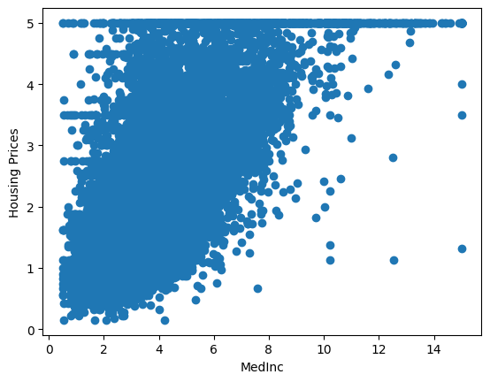
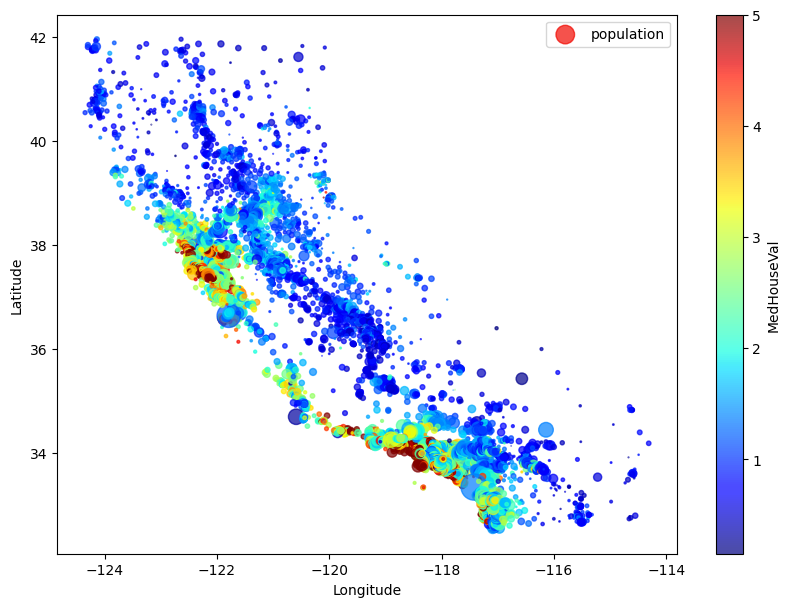

# Linear Regression on California Housing Dataset 

This project focuses mainly on predicting housing prices using linear Regression method and testing R2 score along with Mean squared error in order to check the reliability of the model implemented on the available dataset 

## Implementation Details

- Dataset: California Housing Dataset (view below for more details)
- Model: [Linear Regressor](https://scikit-learn.org/stable/modules/generated/sklearn.linear_model.LinearRegression.html)
- Input: 8 features - [shown in dataset details]
- Output: House Price

## Dataset Details

This dataset was obtained from the StatLib repository ([Link](https://www.dcc.fc.up.pt/~ltorgo/Regression/cal_housing.html))

This dataset was derived from the 1990 U.S. census, using one row per census block group. A block group is the smallest geographical unit for which the U.S. Census Bureau publishes sample data (a block group typically has a population of 600 to 3,000 people).

A household is a group of people residing within a home. Since the average number of rooms and bedrooms in this dataset are provided per household, these columns may take surprisingly large values for block groups with few households and many empty houses, such as vacation resorts.

It can be downloaded/loaded using the sklearn.datasets.fetch_california_housing function.

- [California Housing Dataset in Sklearn Documentation](https://scikit-learn.org/stable/modules/generated/sklearn.datasets.fetch_california_housing.html)
- 20640 samples
- 8 Input Features: 
    - MedInc median income in block group
    - HouseAge median house age in block group
    - AveRooms average number of rooms per household
    - AveBedrms average number of bedrooms per household
    - Population block group population
    - AveOccup average number of household members
    - Latitude block group latitude
    - Longitude block group longitude
- Target: Median house value for California districts, expressed in hundreds of thousands of dollars ($100,000)

## Evaluation and Results

the model has average amount of error in <x, y, z regions>

| Metric        | Value         |
| ------------- | ------------- |
| R2 Score      | 0.614         |
| MSE           | 0.521         |

The above quant results show that 
R2_score of 61.4% is not the best it may be possible to add more relevant features like growth rate of prices in history etc. and mean squared error can be improved as well.

this plot shows medinc to housin prices 


this plot shows housing value with respect to  latitude - longitude ~ location 



## Key Takeaways

i learnt a lot of things from this project, for a fact using irrelevent features end up with incompetent model.


## How to Run

The code is built on Google Colab on an iPython Notebook. 

```bash
Simply download the repository, upload the notebook and dataset on colab 'https://colab.research.google.com/', and hit play!
```

## Roadmap

What are the future modification you plan on making to this project?

- Try more models

- Wrapped Based Feature Selection 


## Libraries 

**Language:** Python

**Packages:** Sklearn, Matplotlib, Pandas, numpy 


## FAQ

#### How does Linear regression model work

Linear regression predicts the relationship between two variables by assuming a linear connection between the independent and dependent variables. It seeks the optimal line that minimizes the sum of squared differences between predicted and actual values. Applied in various domains like economics and finance, this method analyzes and forecasts data trends. It can extend to multiple linear regression involving several independent variables and logistic regression, suitable for binary classification problems


#### what is california housing dataset?

This dataset was obtained from the StatLib repository (Link)

This dataset was derived from the 1990 U.S. census, using one row per census block group. A block group is the smallest geographical unit for which the U.S. Census Bureau publishes sample data (a block group typically has a population of 600 to 3,000 people).

A household is a group of people residing within a home. Since the average number of rooms and bedrooms in this dataset are provided per household, these columns may take surprisingly large values for block groups with few households and many empty houses, such as vacation resorts.

It can be downloaded/loaded using the sklearn.datasets.fetch_california_housing function.

- [California Housing Dataset in Sklearn Documentation]

## Contact

If you have any feedback/are interested in collaborating, please reach out to me at [](https://www.linkedin.com/in/kartikey-vyas-2a29b9273) &nbsp; <a href="mailto:kvsvyas@gmail.com"> 

## License

[MIT](https://choosealicense.com/licenses/mit/)

